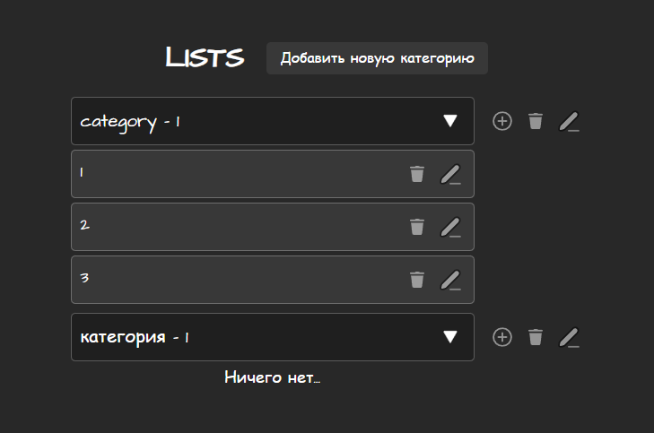
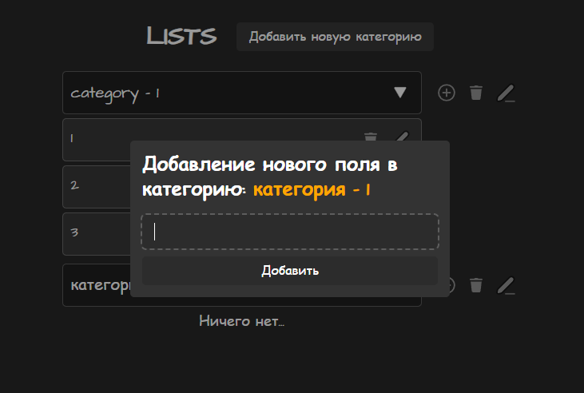
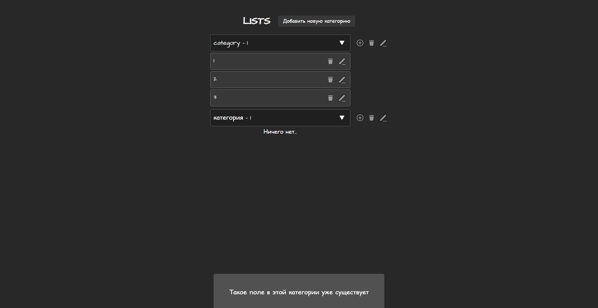

# 📋 Vue Lists — Управление списками задач

[](https://vuejs.org/)
[](https://pinia.vuejs.org/)
[](https://vitejs.dev/)

### https://hutt4.github.io/vue-lists

Простое и интуитивное веб-приложение для создания и управления списками задач с возможностью организации по категориям. Построено на Vue 3 с использованием современного стека технологий.

| Главный экран                          | Редактирование                          | Всплывающая подсказка            |
| -------------------------------------- | --------------------------------------- | -------------------------------- |
|  |  |  |

## ✨ Ключевые возможности

- 🗂️ **Иерархическая организация**:
  - Создание/удаление категорий
  - Вложенные списки задач
- ✏️ **Гибкое управление**:
  - Добавление/редактирование/удаление элементов и категорий
- 🔄 **Реактивность**:
  - Мгновенное обновление интерфейса
  - Валидация в реальном времени
- 💾 **Сохранение данных**:
  - Локальное хранилище (localStorage)

## 🛠 Технологии

- [Vue 3](https://vuejs.org/) - Фреймворк
- [Pinia](https://pinia.vuejs.org/) - Управление состоянием
- [Vite](https://vitejs.dev/) - Сборка проекта

## 🚀 Быстрый старт

### Установка

```bash
git clone https://github.com/huTT4/vue-lists.git

cd vue-lists

npm install

npm run dev
```
