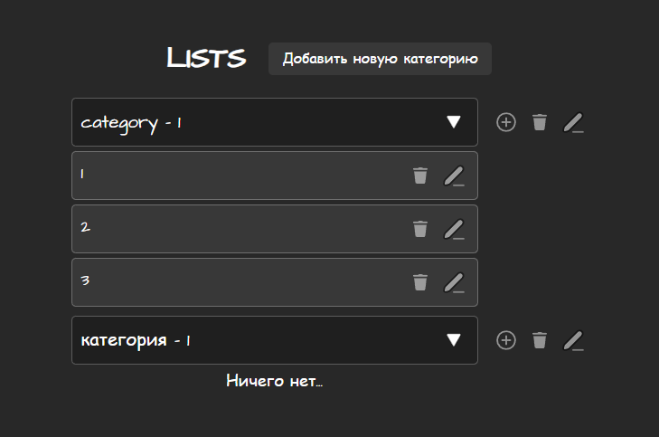
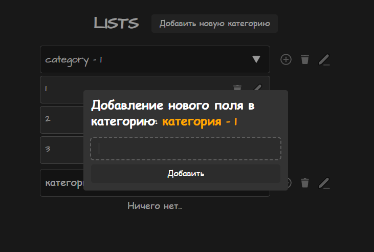
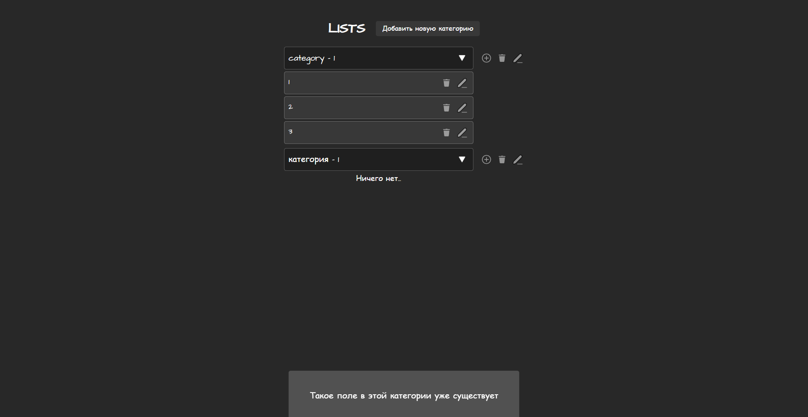

# 📋 Vue Lists — Управление списками задач

Простое и интуитивное веб-приложение для создания и управления списками задач с возможностью организации по категориям. Построено на Vue 3 с использованием современного стека технологий.

[](https://vuejs.org/)
[](LICENSE)
[](https://github.com/huTT4/vue-lists/stargazers)

## ✨ Ключевые возможности

- 🗂️ **Иерархическая организация**:
  - Создание/удаление категорий
  - Вложенные списки задач
- ✏️ **Гибкое управление**:
  - Добавление/редактирование/удаление элементов и категорий
- 🔄 **Реактивность**:
  - Мгновенное обновление интерфейса
  - Валидация в реальном времени
- 💾 **Сохранение данных**:
  - Локальное хранилище (localStorage)

## 🖥️ Скриншоты







## 🚀 Быстрый старт

### Установка

```bash
git clone https://github.com/huTT4/vue-lists.git

cd vue-lists

npm install

npm run dev
```
